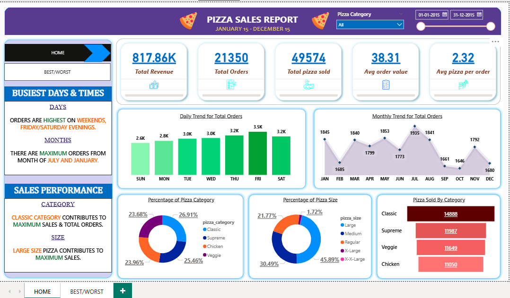
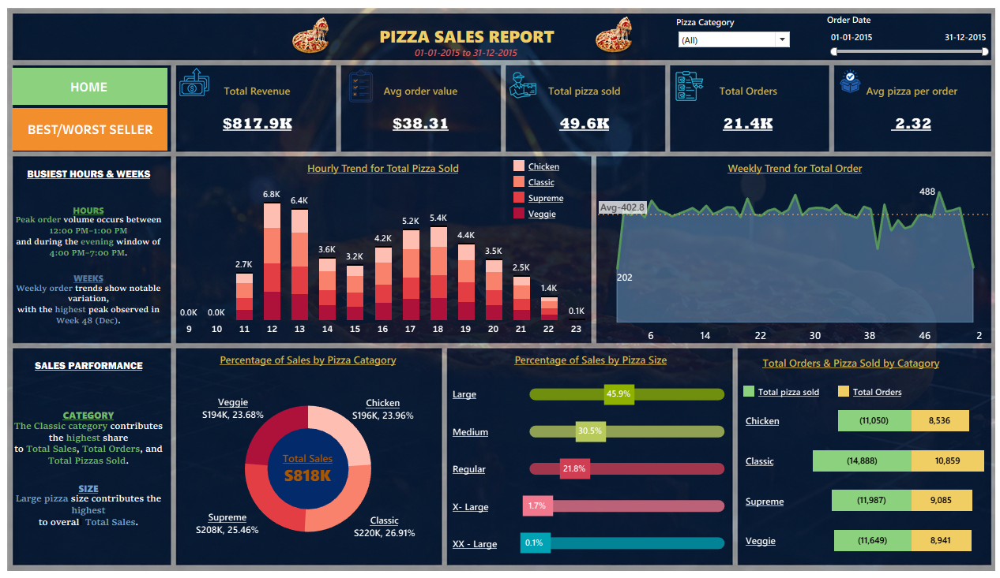

# Pizza Sales Analysis — SQL · Python · Power BI · Tableau


---

A full analytics project on pizza restaurant sales data — from raw Excel records to interactive dashboards. The goal was simple: figure out what's selling, when people are ordering, and where the business can actually improve.

---

## What's Inside

```
pizza_sales-analysis-sql-python-powerbi-tableau-excel/
│
├── Pizza sales analysis (1).ipynb     # Cleaning + EDA in Python
├── pizza_db sql.sql                   # All SQL queries used
├── pizza sales excel.xlsx             # Source dataset
├── PIZZADB_finalproject.pbix          # Power BI dashboard
├── Pizza salesss.twbx                 # Tableau dashboard
└── README.md
```

---

## The Numbers (KPIs)

| Metric | Value |
|--------|-------|
| Total Revenue | $817,860.05 |
| Total Orders | 21,350 |
| Total Pizzas Sold | 49,574 |
| Average Order Value | $38.31 |
| Avg Pizzas per Order | 2.32 |

---

## Key Findings

- **Fridays and Saturdays** drive the most orders — weekday traffic drops significantly
- **Lunch (12–2 PM) and dinner (6–9 PM)** are the two clear peak windows
- **Large size** generates the most revenue; Medium is ordered most frequently
- **Thai Chicken Pizza** is the top revenue contributor — nearly consistent across months
- The bottom 5 pizzas account for a disproportionately small share of sales, yet take up inventory space

---

## How the Analysis Was Done

### Python — Cleaning & EDA
Loaded the raw Excel file, handled duplicates, fixed date/time formats, and engineered time-based columns (hour, day of week, month). Ran distribution analysis across categories, sizes, and time periods using Matplotlib and Seaborn.

### SQL — KPI Extraction
Wrote queries against SQL Server to calculate revenue metrics, daily/monthly trends, and pizza rankings. Used window functions (`RANK()`, `DENSE_RANK()`) to identify top and bottom performers by revenue and quantity.

Example query — Top 5 pizzas by revenue:
```sql
SELECT TOP 5
    pizza_name,
    ROUND(SUM(total_price), 2) AS total_revenue
FROM pizza_sales
GROUP BY pizza_name
ORDER BY total_revenue DESC;
```

### Dashboards
Built two separate dashboards with the same underlying data to cross-validate insights and practice both tools.

**Power BI**


**Tableau**


---

## What I'd Actually Recommend (Based on the Data)

1. **Push Thai Chicken and BBQ Chicken harder on weekends** — they already sell well, weekend promotions could amplify that without much risk
2. **Cut or rotate the bottom 5 pizzas** — they're not pulling weight and are probably adding complexity to prep
3. **Staff up between 12–2 PM and 6–9 PM** — the drop-off outside these windows is sharp enough that off-peak labor can be reduced
4. **Bundle Medium + drink deals** — Medium is the most ordered size but not the highest revenue; a combo could lift average order value

---

## Dataset

Source: [Pizza Sales Dataset — Kaggle](https://www.kaggle.com/) *(update this link with the exact source if different)*

---

## Running It Locally

```bash
git clone https://github.com/sanjoykarmakarr/pizza_sales-analysis-sql-python-powerbi-tableau-excel.git
cd pizza_sales-analysis-sql-python-powerbi-tableau-excel

pip install pandas numpy matplotlib seaborn jupyter
jupyter notebook "Pizza sales analysis (1).ipynb"
```

- Power BI → open `PIZZADB_finalproject.pbix` in Power BI Desktop
- Tableau → open `Pizza salesss.twbx` in Tableau Public/Desktop

---

## Skills Covered

Data cleaning · Exploratory data analysis · SQL (aggregations, window functions) · KPI design · Power BI · Tableau · Business insight communication

---

**Sanjoy Karmakar**  
androsanjoy@gmail.com · [LinkedIn](https://www.linkedin.com/in/sanjoy-karmakar-733a3925b/)
